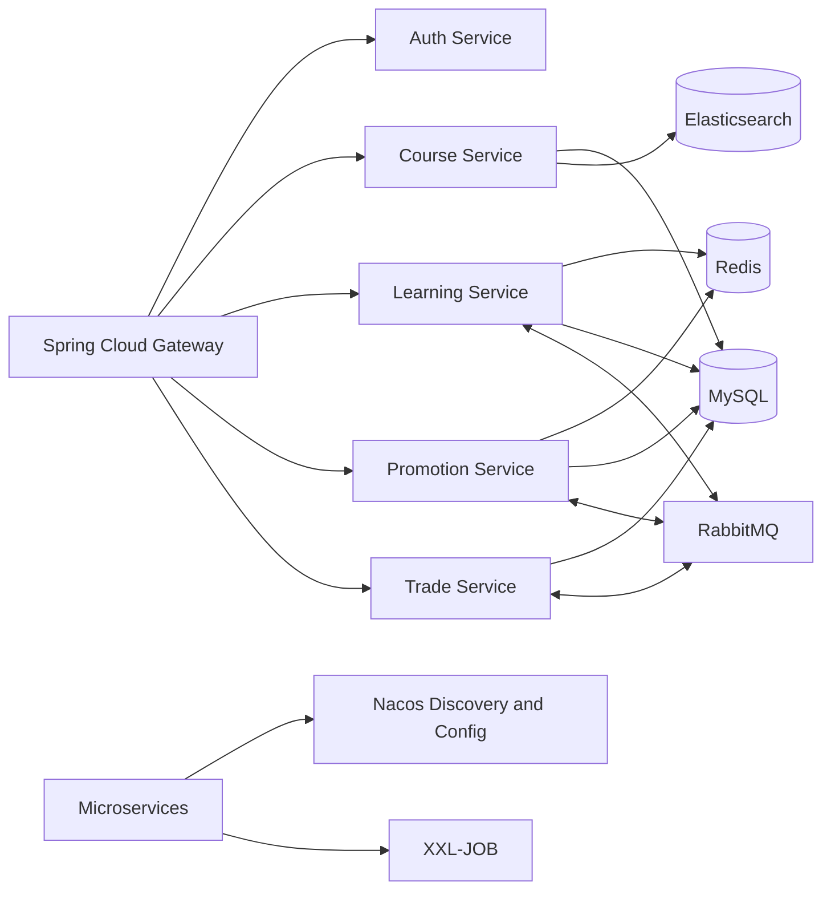

# LearnForge

LearnForge is a backend Java microservices platform for online course delivery, learning progress tracking, promotions, and order processing. This repository contains the service layer and infrastructure integrations; it does not include frontend code.

The portfolio edition is designed for high-concurrency backend workloads involving coupon claims, exchange-code redemption, learning progress updates, check-ins, and real-time leaderboards. It uses Redis atomic operations, distributed locks, asynchronous messaging, and write coalescing to reduce database contention and protect shared state.

## Project Highlights

- Tracks lessons, video progress, study plans, daily check-ins, and course Q&A.
- Maintains real-time points leaderboards with Redis sorted sets.
- Archives seasonal leaderboard data into dynamically routed MySQL tables.
- Supports coupon publishing, claiming, redemption, exchange codes, and expiration.
- Protects coupon inventory with Redis and distributed locks during concurrent requests.
- Uses atomic Redis counters to enforce coupon inventory and per-user claim limits.
- Evaluates coupon combinations in parallel to find the best available discount.
- Uses RabbitMQ to decouple learning events, rewards, orders, and promotion workflows.

## Core Services

| Service | Responsibility |
| --- | --- |
| `lf-learning` | Learning progress, study plans, check-ins, points, leaderboards, and Q&A |
| `lf-promotion` | Coupon lifecycle, exchange codes, inventory protection, and discount calculation |
| `lf-course` | Course content, categories, instructors, media references, and publishing |
| `lf-trade` | Shopping cart, orders, enrollment, payment status, and refunds |
| `lf-user` | Students, instructors, staff accounts, and user profiles |
| `lf-auth` | Authentication, authorization, roles, menus, and permissions |
| `lf-search` | Course search and interest-based discovery |
| `lf-media` | File and video metadata management |
| `lf-message` | In-app notifications and SMS workflows |
| `lf-gateway` | API routing and authentication propagation |

## Architecture



## Technology Stack

### Backend

- Java 11 and Spring Boot 2.7
- Spring MVC and REST APIs
- Spring Cloud Gateway
- OpenFeign for service-to-service HTTP calls
- Spring Cloud LoadBalancer
- Sentinel for service protection and fallback handling

### Data and Messaging

- MySQL
- MyBatis and MyBatis-Plus
- Redis
- Redisson distributed locks
- RabbitMQ
- Elasticsearch

### Microservice Infrastructure

- Nacos for service discovery and centralized configuration
- Seata for distributed transaction support
- XXL-JOB for scheduled and distributed jobs
- Knife4j/OpenAPI for API documentation

### Build and Operations

- Maven
- Docker
- JUnit
- Jenkins-compatible deployment script
- Alibaba Cloud and Tencent Cloud storage, media, SMS, and payment integrations


## Notable Engineering Work

### High-Concurrency Design

The learning and promotion services use several mechanisms to handle concurrent requests safely and keep synchronous request paths lightweight:

- Applies a distributed lock per coupon during claims so multiple application instances cannot oversell the same inventory.
- Uses atomic Redis hash increments for coupon stock and per-user limits, with compensating increments when validation or message publishing fails.
- Marks exchange-code usage with a Redis bitmap to prevent duplicate redemption with a compact atomic operation.
- Allocates exchange-code serial ranges through atomic Redis increments and generates codes asynchronously with a bounded executor.
- Publishes successful claims and learning rewards to RabbitMQ so database persistence can happen outside latency-sensitive request paths.
- Stores daily check-ins in Redis bitmaps, making duplicate detection and streak calculation memory-efficient.
- Updates leaderboard scores with atomic Redis sorted-set increments instead of database read-modify-write operations.
- Coalesces frequent video-progress updates in Redis and a delay queue, reducing repeated writes for the same lesson section.
- Evaluates independent coupon combinations concurrently through a dedicated executor.

These choices make the code suitable for bursty, high-contention workflows. The repository does not claim a fixed throughput number because formal load-test benchmarks are not included.

### Learning and Engagement

- Records video progress while limiting unnecessary database writes.
- Stores monthly check-ins as Redis bitmaps.
- Applies daily reward limits and publishes points events asynchronously.
- Builds real-time rankings with Redis sorted sets.
- Persists completed seasons and supports historical leaderboard queries.

### Promotions and Coupons

- Handles coupon inventory and per-user claim limits under concurrency.
- Uses distributed locking to protect redemption and exchange-code workflows.
- Generates compact exchange codes from encoded identifiers.
- Calculates threshold, percentage, no-minimum, and tiered discounts.
- Compares valid coupon combinations concurrently and returns the best result.

## Build

Requirements:

- JDK 11
- Maven 3.8+
- MySQL, Redis, RabbitMQ, Nacos, and supporting services for runtime testing

Compile the complete project without running tests:

```bash
mvn -DskipTests compile
```

The full 27-module Maven reactor has been verified with JDK 11.

## Repository Naming

The project uses the `com.learnforge` Java namespace and `lf-*` Maven module names.

