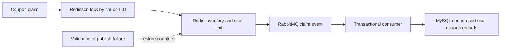
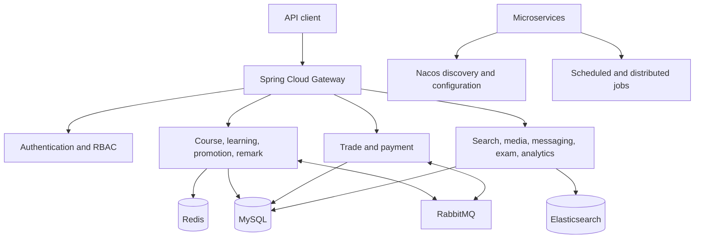

# LearnForge

LearnForge is a backend-only online learning platform built as a set of Spring Cloud microservices. It covers course delivery, learning activity, promotions, engagement, search, orders, payments, notifications, and reporting. The repository does not contain frontend code.

The main portfolio work is concentrated in three services:

- `lf-learning`: video progress, study plans, Q&A, check-ins, points, and seasonal leaderboards
- `lf-promotion`: coupon issuance, high-concurrency claims, exchange codes, and discount selection
- `lf-remark`: reusable likes, batched count propagation, and asynchronous persistence

## Engineering focus

### High-concurrency coupon claims

Coupon inventory and per-user limits are kept in Redis during an active campaign. A claim is serialized by coupon ID with a Redisson lock, then validated through atomic Redis hash increments. If inventory, user limits, or message publishing fails, the service compensates the Redis counters before returning an error.

Successful claims are sent to RabbitMQ. The consumer performs a second database-level validation, conditionally increments issued inventory, and creates the user's coupon record in a transaction. This keeps the request path short while retaining a persistent consistency check.



### Learning progress and rewards

Video playback updates are coalesced instead of writing every progress event directly to MySQL. The service caches the latest section position in a Redis Hash and schedules delayed persistence through a `DelayQueue`; section completion is written immediately.

Daily check-ins use one Redis Bitmap per user and month. Bit operations detect duplicate check-ins and calculate consecutive-day streaks without storing one row per day. Q&A and check-in events publish rewards through RabbitMQ, while Redis Sorted Sets maintain the current points leaderboard with atomic score updates.

At the end of a season, sharded scheduled jobs copy leaderboard pages from Redis into season-specific MySQL tables. Historical queries use dynamic table routing, and the expired Redis leaderboard is removed after persistence.

### Likes and write-behind aggregation

The remark service stores each business object's liked users in a Redis Set. Multi-item like-status checks use Redis pipelining to avoid repeated network round trips.

Like counts are coalesced in a Redis Sorted Set. A scheduled task removes a bounded batch every 20 seconds and publishes the latest counts to RabbitMQ; the owning service then updates its records in batches. Repeated likes and unlikes therefore collapse into the most recent count before database persistence.

### Promotion calculation

The promotion service supports fixed-amount, percentage, no-threshold, and tiered discounts through a strategy interface. It filters coupons by order value and course scope, generates valid ordered combinations, evaluates them concurrently with `CompletableFuture`, and returns the best results by discount value and coupon count.

Exchange codes combine a Redis-allocated serial number with a checksum and an encoded payload. Codes are generated asynchronously, validated before lookup, and marked as redeemed through a Redis Bitmap to reject duplicate use.

## Platform architecture



## Service map

| Module | Responsibility |
| --- | --- |
| `lf-learning` | Learning records, plans, Q&A, check-ins, points, and leaderboards |
| `lf-promotion` | Coupon lifecycle, exchange codes, claim concurrency, and discount calculation |
| `lf-remark` | Likes, pipelined status reads, and write-behind count aggregation |
| `lf-course` | Course drafts, catalogues, instructors, media references, and publishing |
| `lf-trade` / `lf-pay` | Cart, orders, enrollment, payment orchestration, and refunds |
| `lf-auth` / `lf-gateway` | JWT authentication, RBAC, request filtering, and API routing |
| `lf-search` | Elasticsearch course search, recommendations, and event-driven index updates |
| `lf-message` / `lf-media` | Notifications, SMS adapters, file metadata, and video processing |
| `lf-exam` / `lf-data` | Question bank, scoring data, dashboards, and reporting |
| `lf-user` | Student, instructor, staff, and profile management |
| `lf-api` / `lf-common` | Shared clients, DTOs, error handling, messaging, locking, and infrastructure helpers |

## Technology

The primary stack is Java 11, Spring Boot 2.7, Spring Cloud Gateway, OpenFeign, MySQL, MyBatis-Plus, Redis, Redisson, RabbitMQ, Elasticsearch, Maven, Docker, and JUnit.

The project also uses Nacos for service discovery and configuration, Seata for distributed transactions, XXL-JOB for distributed scheduling, Sentinel for service protection, and Knife4j/OpenAPI for API documentation. These tools are part of the implementation but are kept secondary here because they are less common in the US market than the core stack above.

Alibaba Cloud and Tencent Cloud adapters are included for storage, video, SMS, and payment workflows.

## Build

Requirements:

- JDK 11
- Maven 3.8 or newer
- MySQL, Redis, RabbitMQ, Nacos, and the configured supporting services for a full runtime environment

Compile the complete Maven reactor without running tests:

```bash
mvn -DskipTests compile
```

The complete 27-module Maven reactor has been compiled successfully with JDK 11. Runtime verification requires the external infrastructure and configuration referenced by the service bootstrap files.

