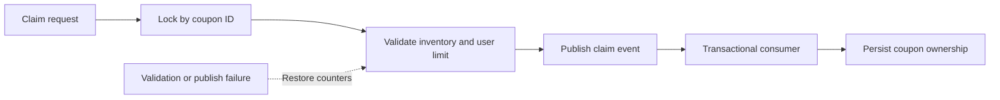
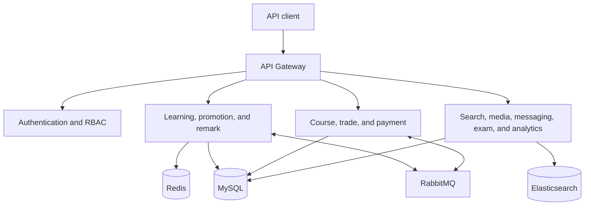

# LearnForge

LearnForge is a backend-only online learning platform built with Java and Spring Boot microservices. It supports the main lifecycle of an education product: publishing courses, enrolling students, tracking study progress, rewarding engagement, applying promotions, processing orders, and searching course content. The repository does not contain frontend code.

The main portfolio work is concentrated in three services:

- `lf-learning` for lessons, playback progress, study plans, check-ins, points, leaderboards, and course questions
- `lf-promotion` for coupon campaigns, concurrent claims, exchange codes, and discount selection
- `lf-remark` for reusable likes and asynchronous like-count persistence

The backend is designed for write-heavy activity such as playback heartbeats, coupon claims, check-ins, leaderboard updates, and likes. Redis handles shared hot state, RabbitMQ moves non-critical work off request threads, and MySQL remains the system of record.

## Product capabilities

- Course draft, catalogue, instructor, media, publishing, and search workflows
- Student enrollment after order payment, personal course lists, study plans, and progress tracking
- Course questions, engagement points, monthly check-ins, and current or historical leaderboards
- Coupon creation, campaign issuance, public claims, exchange-code redemption, and cart-level discount recommendations
- Reusable likes for multiple business types, including questions and notes
- Shopping cart, order, payment, refund, notification, media, assessment, and reporting services
- JWT authentication, role-based access control, gateway routing, and user-context propagation

## Engineering focus

### High-concurrency coupon claims

An active coupon campaign is cached in Redis with remaining inventory and per-user claim counts. The claim path uses an annotation-driven Redisson lock keyed by coupon ID, then performs atomic Redis Hash increments to enforce stock and user limits. If validation or message publishing fails, the service restores the counters.

Accepted claims are published to RabbitMQ. A consumer repeats the important checks, conditionally increments issued inventory in MySQL, and creates the user-coupon record in a transaction. This shortens the synchronous request while retaining a database consistency boundary.



The shared lock component uses a custom annotation, AOP, and SpEL-based lock names. Lock type selection and acquisition behavior are separated behind factory and strategy abstractions.

### Learning progress and rewards

Orders publish payment events through RabbitMQ, and the learning service consumes those events to add purchased courses to a student's lesson list. A lesson tracks course status, completed sections, the latest section, recent study time, plan frequency, and expiration.

Video clients submit playback progress frequently so a student can resume on another device. Writing every heartbeat to MySQL would create unnecessary load. The service caches the latest position for each lesson section in a Redis Hash and schedules a delayed check with Java's `DelayQueue`. Newer updates overwrite stale progress, so repeated heartbeats for the same section become one database write. Section completion is persisted immediately and updates the lesson summary.

Daily check-ins use one Redis Bitmap per user and month. Bit operations detect duplicate check-ins and calculate consecutive-day streaks without storing one row per day. Course-question and check-in events publish rewards through RabbitMQ, while consumers enforce daily point limits by activity type. Redis Sorted Sets maintain the current leaderboard with atomic score updates.

At the end of a season, sharded jobs copy leaderboard pages from Redis into season-specific MySQL tables. Historical queries use dynamic table routing, and the old Redis leaderboard is removed after persistence.

### Likes and write-behind aggregation

The remark service identifies each target by `bizType` and `bizId`, so the same implementation can support questions, answers, and notes without coupling likes to one domain table. A Redis Set stores the users who liked each target and naturally prevents duplicate likes. Multi-item status checks use Redis pipelining to avoid repeated network round trips.

Like counts are coalesced in a Redis Sorted Set. A scheduled task removes a bounded batch every 20 seconds and publishes the latest counts to RabbitMQ; the owning service then applies batch database updates. Sorted Set members are unique, so repeated likes and unlikes during the aggregation window collapse into the most recent count instead of causing redundant writes.

### Promotion calculation

The promotion service supports fixed-amount, percentage, no-threshold, and tiered discounts through a strategy interface. For a cart, it filters coupons by order value and course scope, generates eligible ordered combinations, evaluates them concurrently with `CompletableFuture`, allocates each discount across applicable courses, and ranks the results by savings and coupon count.

Exchange codes are generated asynchronously from Redis-allocated serial ranges. Each code contains an encoded payload and checksum, allowing malformed codes to be rejected before a database lookup. A Redis Bitmap records redeemed serial numbers so repeated redemption can be detected with one atomic bit operation.

## Platform architecture



## Service map

| Module | Responsibility |
| --- | --- |
| `lf-learning` | Learning records, plans, Q&A, check-ins, points, and leaderboards |
| `lf-promotion` | Coupon lifecycle, exchange codes, claim concurrency, and discount calculation |
| `lf-remark` | Likes, pipelined status reads, and write-behind count aggregation |
| `lf-course` | Course drafts, catalogues, instructors, media references, and publishing |
| `lf-trade` / `lf-pay` | Cart, orders, enrollment, payment orchestration, and refunds |
| `lf-auth` / `lf-gateway` | JWT authentication, RBAC, request filtering, and API routing |
| `lf-search` | Elasticsearch course search, recommendations, and event-driven index updates |
| `lf-message` / `lf-media` | Notifications, SMS adapters, file metadata, and video processing |
| `lf-exam` / `lf-data` | Question bank, scoring data, dashboards, and reporting |
| `lf-user` | Student, instructor, staff, and profile management |
| `lf-api` / `lf-common` | Shared clients, DTOs, error handling, messaging, locking, and infrastructure helpers |

## Technology

Primary stack:

- Java 11, Spring Boot 2.7, Spring MVC, Spring Cloud Gateway, and OpenFeign
- MySQL, MyBatis-Plus, Redis, Redisson, and Elasticsearch
- RabbitMQ, Maven, Docker, and JUnit

The implementation also includes Nacos, Seata, XXL-JOB, Sentinel, and cloud-provider adapters for configuration, transactions, scheduling, resilience, media, SMS, and payment integrations. They are supporting infrastructure rather than the focus of this portfolio edition.

## Build

Requirements:

- JDK 11
- Maven 3.8 or newer
- MySQL, Redis, RabbitMQ, Nacos, and the configured supporting services for a full runtime environment

Compile the complete Maven reactor without running tests:

```bash
mvn -DskipTests compile
```

The complete 27-module Maven reactor has been compiled successfully with JDK 11. Runtime verification requires the external infrastructure and configuration referenced by the service bootstrap files.
